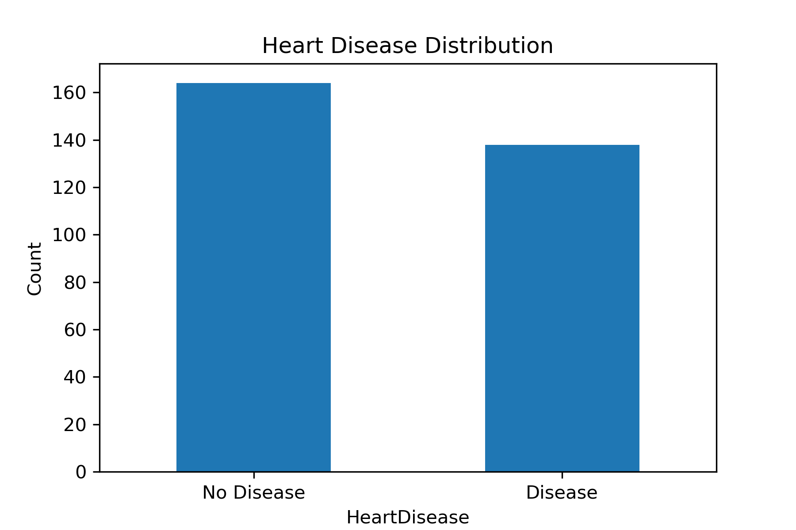
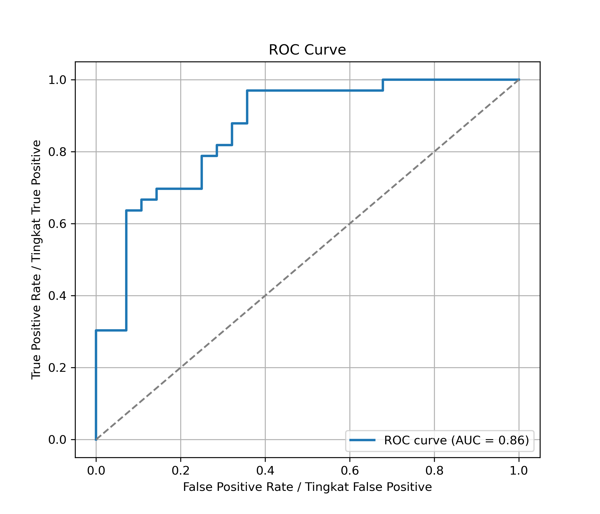
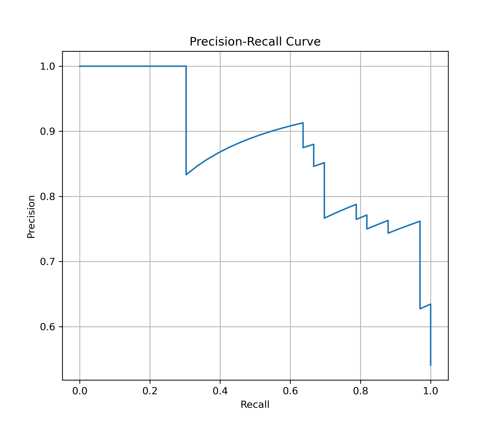
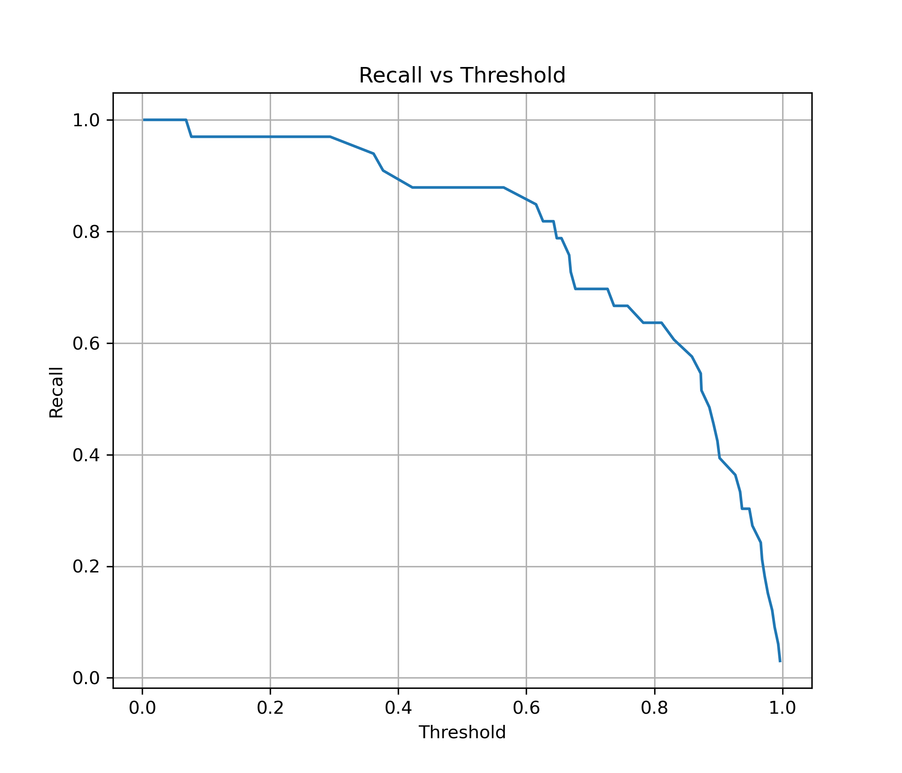
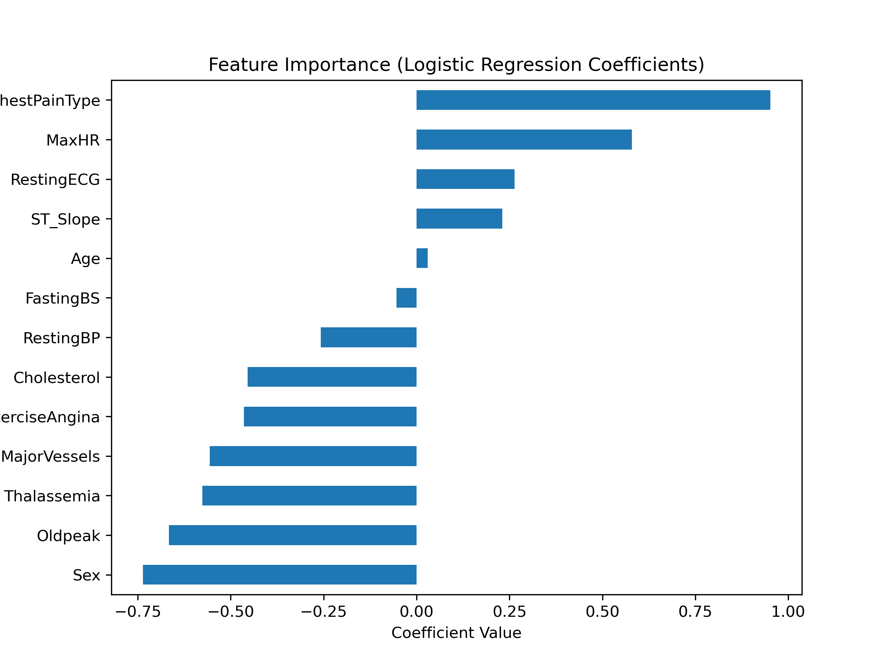

# ❤️ Heart Disease Prediction – Logistic Regression

---

## GB Project Overview (English)

This project aims to build a classification model to predict heart disease using machine learning techniques.

The objective is to demonstrate understanding of:

- Data preprocessing & cleaning
- Exploratory Data Analysis (EDA)
- Feature scaling
- Logistic Regression modeling
- Threshold tuning
- Model evaluation (ROC & Precision-Recall)
- Model interpretability

This project is designed as a portfolio case study for aspiring Data Scientists.

---

## 🇮🇩 Gambaran Proyek (Bahasa Indonesia)

Proyek ini bertujuan untuk membangun model klasifikasi untuk memprediksi penyakit jantung menggunakan teknik machine learning.

Tujuan utama proyek ini adalah menunjukkan pemahaman mengenai:

- Pembersihan dan preprocessing data
- Exploratory Data Analysis (EDA)
- Feature scaling
- Pemodelan Logistic Regression
- Penyesuaian threshold
- Evaluasi model (ROC & Precision-Recall)
- Interpretasi model

Proyek ini dibuat sebagai studi kasus portfolio untuk Data Scientist.

---

# 📊 Dataset

The dataset contains medical attributes such as:

- Age
- Cholesterol
- Blood Pressure
- Chest Pain Type
- Maximum Heart Rate
- And other clinical indicators

Target variable:
- `HeartDisease` (0 = No Disease, 1 = Disease)

---

# ⚙️ Machine Learning Workflow

1. Data Cleaning (handling missing values & duplicates)
2. Exploratory Data Analysis
3. Train-Test Split (Stratified)
4. Feature Scaling (StandardScaler)
5. Logistic Regression Model Training
6. Custom Threshold Adjustment (0.1)
7. Model Evaluation:
   - Confusion Matrix
   - Classification Report
   - ROC-AUC
   - Precision-Recall Curve
8. Feature Importance (Model Interpretability)

---

# 📈 Model Performance

- ROC-AUC Score: **0.8647**
- Custom Threshold Used: **0.1**
- Recall prioritized to reduce false negatives

### Why threshold = 0.1?

Lowering the threshold increases recall, which is important in medical screening scenarios where missing positive cases can be critical.

Menurunkan threshold meningkatkan recall, yang penting dalam skenario medis agar tidak melewatkan pasien yang berisiko.

---

# 📊 Visualizations

### 1️⃣ Heart Disease Distribution

### 2️⃣ ROC Curve

### 3️⃣ Precision-Recall Curve

### 4️⃣ Recall vs Threshold

### 5️⃣ Feature Importance

---

# 🧠 Key Insights

- Lower threshold increases recall but may reduce precision.
- ROC-AUC indicates the model can distinguish between classes effectively.
- Certain medical features have stronger influence on heart disease prediction.
- Logistic Regression provides interpretable coefficients for risk analysis.

---

# 🚀 Future Improvements

- Cross-validation
- Hyperparameter tuning
- Compare with Random Forest & SVM
- Handle class imbalance (e.g., SMOTE)
- Model deployment (Flask / Streamlit)

---

# 🛠️ Tech Stack

- Python
- Pandas
- NumPy
- Scikit-Learn
- Matplotlib

---

# 👤 Author

## Bakhtiyar Ghozi  
Aspiring Data Scientist  
GitHub: @bghozi
